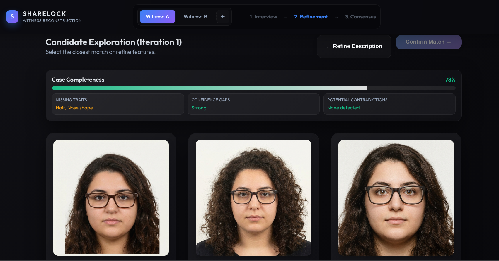

# ShareLock
_Submission to the Gemini 3 Paris Hackathon organized by Cerebral Valley on 14.03.2026 which was awarded 2nd place._

**Problem?** Still in 2026 forensic sketching is used to identify criminals. This process is slow and costly. Humans experts struggle to effectively combine all possible supporting evidence and statements of multiple witnesses.

**Solution?** ShareLock helps combine witness information through interactions with users, collecting both descriptions and reported evidence. It uses Gemini's multimodal reasoning capabilities to synthetize possible candidate faces with Imagen. The witnesses can refine those using selection mechanism and confidence on different features.



**Demonstration** Check out our [video demonstration](https://youtu.be/pvtD1TvSsiA) to see our assistant in action!

# Run the code yourself!

## 1) Environment setup

Create a local environment file:

```bash
cp .env.example .env
```

Then set your Gemini API key in `.env`:

```env
VITE_GEMINI_API_KEY=your_gemini_api_key_here
```

Notes:
- Vite only exposes variables prefixed with `VITE_` to frontend code.
- The app can also store/update the key in browser `localStorage` (`gemini_api_key`).

## 2) Install and run

```bash
npm install
npm run dev
```

Open the local URL shown in terminal (typically `http://localhost:5173`).

## 3) How to use the app

1. Choose a witness (A/B/...) in the header.
2. **Interview**: collect witness description and structured traits.
3. **Refinement**: generate and iterate candidate suspect images.
4. Repeat for other witnesses.
5. **Consensus**: combine witness outcomes into a final result.

## Available scripts

- `npm run dev` — start development server
- `npm run build` — create production build
- `npm run preview` — preview production build locally
- `npm run lint` — run ESLint
